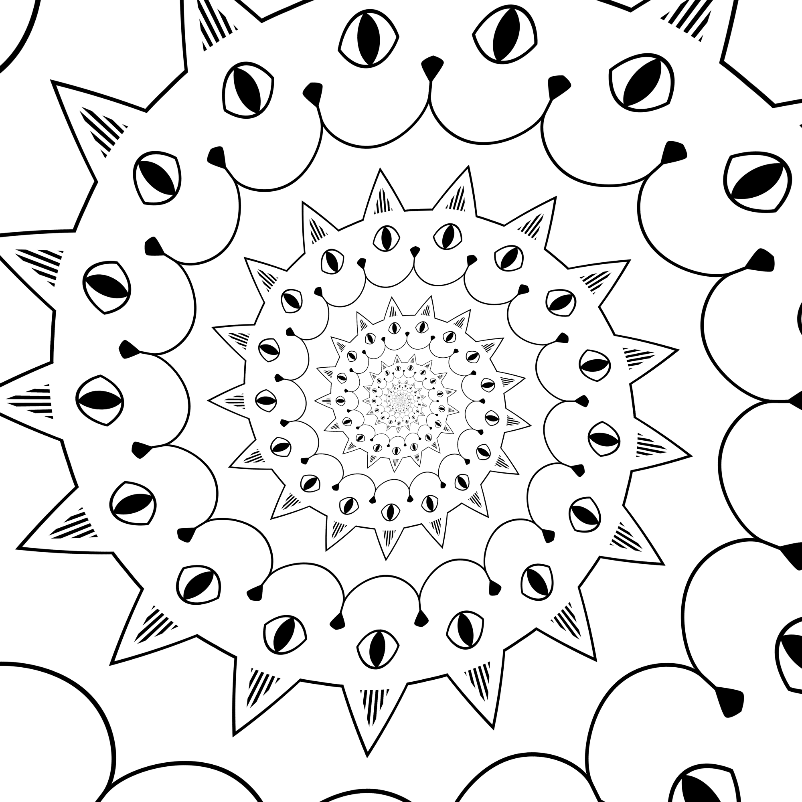

White background: [0](output/mapcat_0.png), [1](output/mapcat_1.png), [2](output/mapcat_2.png)

Black background: [0](output/mapcat_0_neg.png), [1](output/mapcat_1_neg.png), [2](output/mapcat_2_neg.png)

